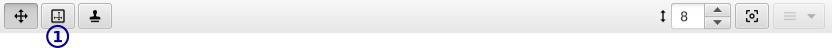
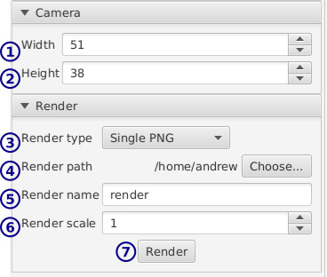

[top](userguide.md)

# Camera layer

A camera layer is a [group layer](group_layer.md) but it additional defines a "window" - a rectangular region used to determine export boundaries.

When a camera layer is visible you'll see the window as a grey outlined rectangle in the editor.

The window is always centered around the origin, but you can use the group layer and frame offset tools to center things.

Only camera-specific features are described here.

## Toolbar

* **1** / Adjust window

   Click and drag to resize the camera window.

## Camera settings

* **1** **2** / Window width/height

   You can adjust the window size numerically here.

* **3** / Render type

   What sort of render you want to make.

   * Single PNG - render a still/single jpg
   * GIF - render an animated GIF.  Note: You need at least 3 colors in your image right now to work around an export bug.
   * WebM - render a WebM animation.
   * PNG Sequence - render a numbered PNG for each frame.

* **4** / Render path

   Where to output the rendered files

* **5** / Render name

   The base name of the rendered file.

   Don't add an extension - depending on the render type a number and extension will be added.

* **6** / Render scale

   Scale the image up by this factor when rendering.  Useful for pixel art which is usually too small to see easily without zooming in on modern monitors.

* **7** / Render

   Render the camera with the above settings.  Rendering only includes children of the camera.

