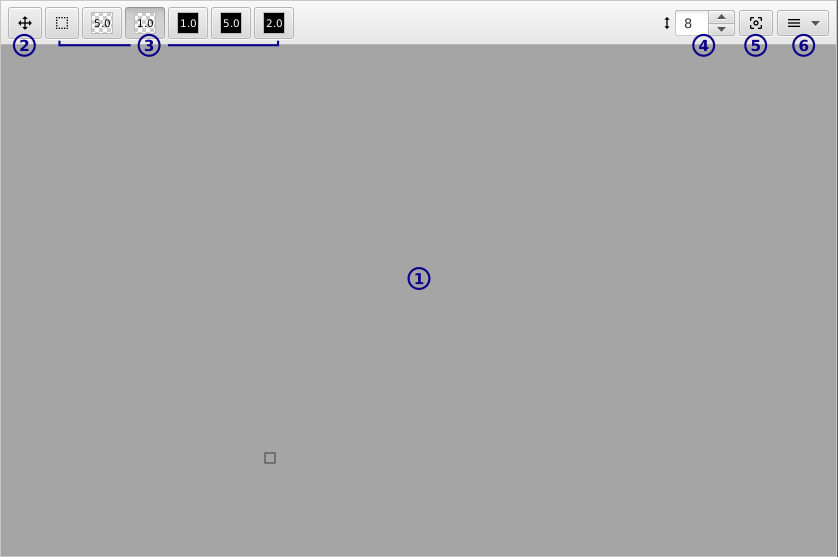

[top](userguide.md)

# Editor section

* **1** / Canvas

   This is where the action happens.  How you modify the canvas depends on the type of layer you're editing and your selected tool.  Use the middle mouse wheel to zoom, and the middle mouse button to scroll.

   Note that there's no edge - all layers are infinitely large.

* **2** / Offset

   This moves the whole layer.  You can use this to align a layer with the origin if you started drawing somewhere random and such things are important to you.

* **3** / Other tools

   The tools displayed here depend on the type of the layer you're currently editing.  See information on layers [here](userguide.md#layers).

* **4** / Zoom

   Increase to zoom in, decrease to zoom out.  0 is 1:1 zoom.  You can also scroll the mouse wheel to zoom.

* **5** / Center view

   Since all layers are infinitely large, if you get lost press this button to go back to the origin.

* **6** / Menu

   Various other operations are here - like add/remove/move brush on palette/true color layers.
