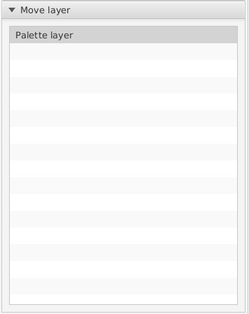
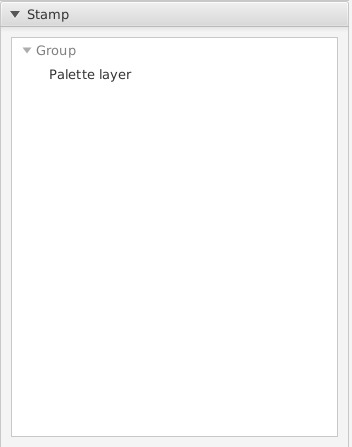
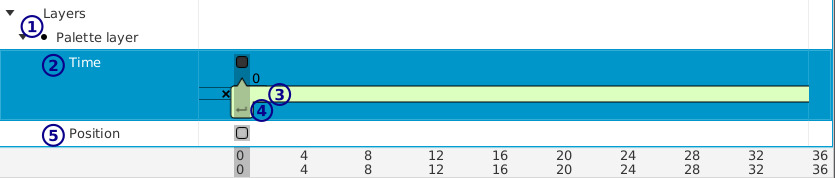

[top](userguide.md)

# Group layer

A group layer combines other layers.  Within a group layers can be moved around and in animations they can be individually looped and translated.

## Toolbar

* **1** / Move layer

   Use this to move the current layer horizontally and verically in the current frame (all layers always have at least one frame).

   To select the child layer to move, open the `Layer` tab:

   

   and click on the appropriate layer.

   The origin of the layer selected to move will appear in the editor.

* **2** / Stamp

   Stamp linked copies of a layer.  This is useful for rapidly placing tiles.

   To select the layer to stamp open the `Layer` tab:

   

   and click on the layer to stamp.

   Each time you click in the editor a new linked copy will be placed.

   Note that you can't stamp any parent of the current group - if you did you'd have an infinite loop.

## Layer settings

See [layer settings](layer_settings.md).

## Timeline

Each layer in a group has it's own frames.

* **1** / Selected child layer

   The dot indicates which layer is selected.  This is synchronized with the `move layer` layer list.

* **2** / Time frames

   A time frame allows you to offset, add/remove time loops, or disable a child layer for a time period.  Use this for looping backgrounds, for example.

   Drag the bar with the X (**3**) to change the start time of the child layer from this frame.  The start time is indicated by the number above.  If you drag to the X, the child layer will be hidden during this frame.

   Drag the loop handle (**4**) to change the duration of the loop.  By default the handle is aligned with the start of the time period and indicates that there is no loop (time increases continuously from the start).

* **5** / Position frames

   A position frame allows you to give a child layer different offsets at different times.  Use the move frame (**6**) tool to change the offset for the visible frame.
