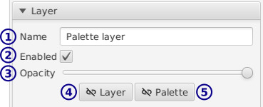

[top](userguide.md)

# Layer settings

In the `Layer` tab:

* **1** / The layer name

* **2** / Toggle layer visibility

   When you're editing a layer, it is temporarily made visible even if this is unchecked.  Scenes (root layers) have no visibility toggle.

* **3** / Opacity

   Scenes (root layers) have no opacity setting.

* **4** / Unlink layer

   If the layer is a linked copy of another layer, this makes it a distinct layer so modifying it won't affect the other layer.

* **5** / Unlink palette

   If this layer is reusing a palette, pressing this button will make the layer use a new palette that's a copy of the original.  Modifying colors won't affect layers using the original palette.

