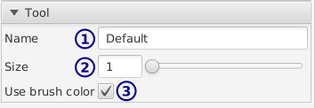

[top](userguide.md)

# Palette brush settings

* **1** / Name

* **2** / Size (diameter)

* **3** / Use per-brush/global color

   When this is checked, if you select a new color only this brush's color is changed.

   This is useful for keeping an "eraser" brush attached to the transparent color, while having other brushes share the painting color.
