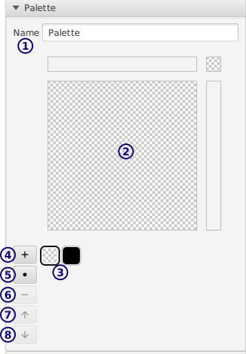

[top](mainwindow.md)

# Palette layer

A palette layer is a paint layer where colors all come from a palette.  If you modify palette colors, everywhere painted with that color will have its color changed.

## Toolbar

* **1** / Select

   Use this to copy, paste, and move sections of the canvas.

* **2** / Brushes

   Each tool button shows the brush size and the selected palette color.

## Layer settings

See [layer settings](layer_settings.md).

## Palette settings

Also in the `Layer` tab:

* **1** / The palette name

* **2** / Color picker

   Use this to change the currently selected color's... color.

* **3** / Palette colors

   This is a grid that shows all the colors in the palette.  The first color is always transparent, and can't be modified/deleted/moved.

   Click on a color to select it for drawing/adjusting.

* **4** / Add color

   Add a new color to the palette after the selected color.

* **5** / Add separator

* **6** / Remove color

   To remove a color, you need to merge it with another color.  To get rid of all the pixels with that color, merge with the 0th transparent palette color entry.

* **7** **8** / Reorder color

## Brush settings

See:

* [Select](select_settings.md) settings
* [Brush](palette_brush_settings.md) settings
