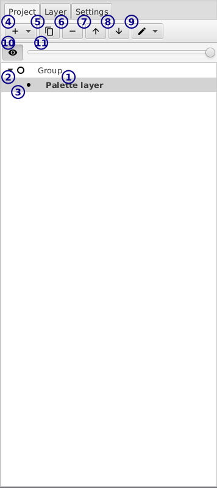

[top](userguide.md)

# Project section

This section has a number of tabs - most are self explanatory but here's an overview of the `Project` tab.

* **1** / The project tree

   The project is composed of a number of scenes, and each scene has layers.

   Any root layer in the tree is a "scene".  Scenes are drawn separately - you can only view one scene at a time.

   Layers and scenes are shown in this tree.  Disabled layers/scenes have their names faded.  When a layer with linked copies is selected, those copies will be shown in bold.

## Viewing and editing

There are two circle icons to the left of the layers:

* **2** / The filled circle indicates what's being edited - in the image, the layer called `Palette layer` is being edited.

   The tools shown in the editor and the layer settings are controlled by this.  You can select another layer to edit by clicking on it.

* **3** / The open circle indicates what's being shown.

   In this case, `Group` and all its children are displayed.  If you double click a layer you'll change the view that subtree.  This is useful if you want to work on just a couple layers that are part of a larger image, but don't want to manually hide all the other layers.

   The shown layer will automatically adjust when you select a layer to edit that's outside the current shown subtree.

   There are hotkeys to move the view closer to the edited note and closer to the root - see the `Settings` tab for all currently available hotkeys.

## Adding, removing, copying layers

The toolbar at the top contains all the buttons for modifying the project structure.

* **4** / Add a layer or duplicate a layer

   See information on layers [here](userguide.md#layers).

* **5** / Duplicate a layer

   Duplicating a layer creates a new, unlinked copy of the current edit layer.

* **6** / Delete a layer

   Removes the layer

* **7** **8** / Move a layer up/down

   This will move a scene up or down or move a layer up or down in the current group.  Lower layers in a group obscure the layers above them.

* **9** / Lift and place layers

   This also allows you to move a scene/layer.  Lifting is like cutting - you can also press `ctrl+x` to toggle whether a layer is lifted.  When you place the layers they will be moved from their current location.  Press `esc` to un-lift everything.

## Changing layer visibility

The two controls below the toolbar allow you to quickly change layer visibility.

* **10** / Toggle layer visibility

* **11** / Change layer opacity