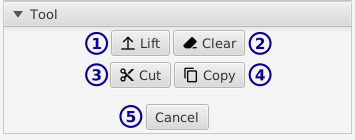
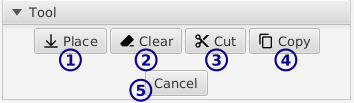

[top](userguide.md)

# Select settings

The select tool has multiple states.  At the start, you can indicate a selection region by clicking and dragging in the editor.

The indicated region will have handles on each side for adjusting the region's size, and the region can be dragged to move it elsewhere.

## When nothing's lifted

* **1** / Lift

   Lift the indicated region.  A lifted region can be moved before placing.

* **2** / Clear

   Erase anything in the indicated region

* **3** / Cut

   Put the region in the clipboard and erase it.

* **4** / Copy

   Put the region in the clipboard.

* **5** / Cancel

   Reset the indicated region.

## When lifted

* **1** / Place

   Drop the lifted region back into the layer.

* **2** / Clear

   Delete the lifted region.

* **3** / Cut

   Put the region in the clipboard and erase it.

* **4** / Copy

   Put the region in the clipboard.

* **5** / Cancel

   Put the lifted region back in its original place and un-lift it.
