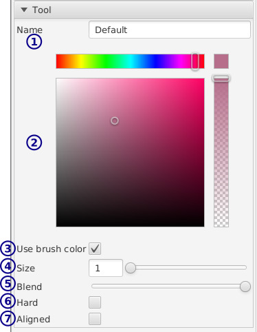

[top](mainwindow.md)

# True color brush settings

* **1** / Name

* **2** / Color picker

* **3** / Use per-brush/global color

   When this is checked, if you select a new color only this brush's color is changed.

   This is useful for keeping an "eraser" brush attached to the transparent color, while having other brushes share the painting color.

* **4** / Size (diameter)

* **5** / Blend

   This determines how much the brush merges with the color you're drawing over.  At full, the brush entirely replaces the existing color.  At half, the brush will be mixed 50:50 with the canvas colors.

   This is separate from the brush color opacity - at full blend, you can paint a transparent color over existing colors, thereby erasing.

* **6** / Hard

   Don't anti-alias.

* **7** / Aligned

   Make the stroke always center on a pixel.  This is helpful for precision pixel editing.  Maybe?
