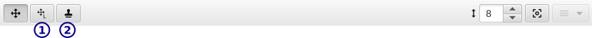
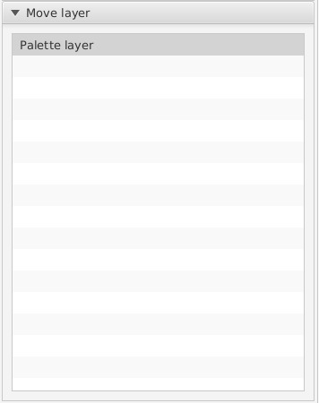
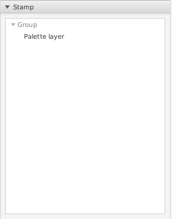
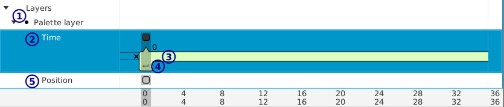

[トップ](userguide.md)

# グループレイヤー

グループレイヤーが子レイヤーを組み合わせます。子レイヤー角に移動やアニメーションループや時間移動できます。

## ツールバー

- **1** / これいやー移動

    Use this to move the current layer horizontally and verically in the current frame (all layers always have at least one frame).

    To select the child layer to move, open the `Layer` tab:

    

    and click on the appropriate layer.

    The origin of the layer selected to move will appear in the editor.

- **2** / スタンプ

    リンクされている複製をスタンプします。例えば、マスを早く置くには便利です。

    To select the layer to stamp open the `Layer` tab:

    

    and click on the layer to stamp.

    Each time you click in the editor a new linked copy will be placed.

    Note that you can't stamp any parent of the current group - if you did you'd have an infinite loop.

## レイヤーの設定

[レイヤー設定](layer_settings.md)ご参照ください。

## タイムライン

グループの子レイヤーごとにフレームあります。

- **1** / 選択の子レイヤー

    塗りつぶされている丸が選択の子レイヤーを示します。レイヤー移動とレイヤースタンプツールの子レイヤーリストとシンクロされています。

- **2** / 時間のフレーム

    時間のフレームで時間によって子レイヤーに時間移動、時間ループ、無効にすることできます。

    「×」あるバー（**3**）をドラッグして子レイヤーのスタート時間を変えます。スタート時間が上の数字に表示されます。 その「×」にまでドラッグするとフレームが終わるまで子レイヤーが無効になります。

    ループハンドル（**4**）をドラッグしてループの長さを変えます。最初にループハンドルがフレームスタートと同位でループしないと表示します（イメージに表示されてる）。

- **5** / 場所のフレーム

    時間によってフレームのイメージを移動できます。これいやー移動ツール（**6**）を使用して現在表示されているフレームの場所を変えられます。
