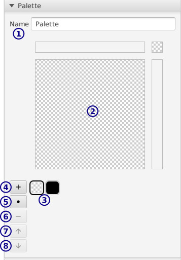

[トップ](userguide.md)

# パレットレイヤー

パレットレイヤーは色全部パレット（配色）の中から選びます。パレットの色を変えるとイメージの色も変わります。

## ツールバー

- **1** / 選択

    キャンバスの示された部分をコピー、ペースト、移動する。

- **2** / ブラッシュ

    各ツールのボタンが色とサイズを表示します。

## レイヤー設定

[レイヤー設定](layer_settings.md)ご参照ください。

## パレット設定

`レイヤー` タブに：

- **1** / パレット名

- **2** / 色変え

    選択されている色を変えます。

- **3** / 色リスト・選択

    パレットの色全部並びます。最初の色はいつも透明ですそして変えられないのです。

    色をクリックして選択できます。

- **4** / 色を挿入

    選択されている色の次に挿入します。

- **5** / 区切りを挿入

- **6** / 色を削除

    色を削除することは他の色と結合することです。色を完全に消すには透明色（一番目）と結合します。

- **7** **8** / 色を移動

## ツール設定

参照ください：

- [選択](select_settings.md)の設定
- [ブラッシュ](palette_brush_settings.md)の設定
