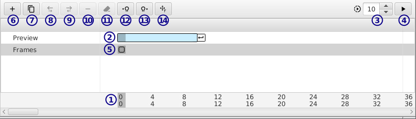

[トップ](userguide.md)

# タイムライン

- **1** / 時間

    数字二行あります：

    上の行は現在表現されてるツリーの*絶対時間*です。必ずゼロから単調増加します。

    下の行は変更中レイヤーの*マップ時間*です。例え[グループ](group_layer.md)でマップがあって変更中レイヤーがループされたらループのスタート時間からストップ時間まで時間繰り返しが表示されます。

    時間移動するにはここでクリック。

- **2** **3** **4** / プレービュー・出力時間選択

    **2**を変更してプレービューのスタート／ストップを変えます。カメラレイヤーで出力時間に鳴ります。

    **3**はフレームレートです。

    **4**プレー切り換えます。プレー中でゴーストが一時的に無効に鳴ります。`space`押すとプレー切り換えもできます。

- **5** / フレーム

    角丸はフレームです。クリックでセレクト切り換えます。ドラッグで移動します。ツールバーのボタンがセレクトされたフレームを影響します。フレームがセレクトされてない場合は表示されてるフレームを影響します。ツール（ブラッシュなど）はいつも表示されてるフレームを影響します。

- **6** / フレーム作成

    現在の時間にフレームを作成します。現在の時間にフレームはもう存在する場合時間単位１先に作成します。

- **7** / 複製を作成

    現在の時間にセレクトをされてるか表示されてるフレームを複製します。

- **8** **9** / 前後フレームを交換

    タイミングを保存してフレームふたつを交換します。

- **10** / フレームを削除

- **11** / フレームをクリア

    フレームを残してフレームの中すべてを削除します。

- **12** **13** / 前／次のフレームのゴーストを有効切り換え

    前後のフレームを表示します。

- **14** / フレーム中心を移動

    絵を移動する。
