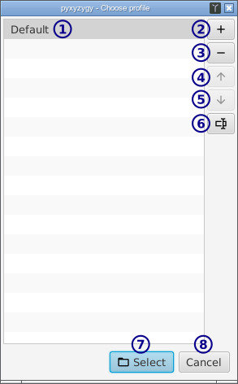
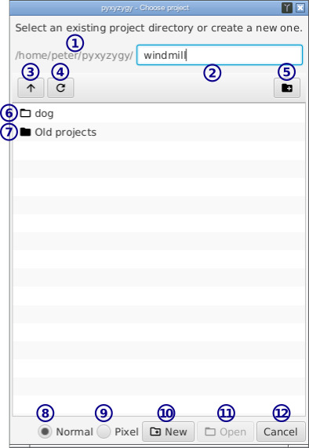
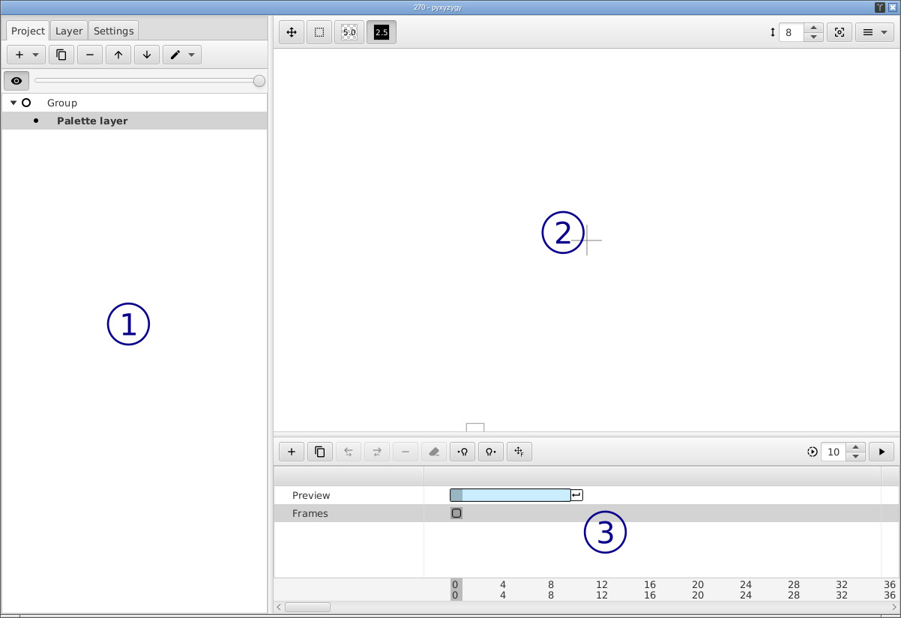

# pyxyzygy ユーザーガイド

## プロフィール選択

プロフィールがプロジェクトのディレクトリ、ディフォルトプロジェクトのタイプ、ブラッシュ設定、背景色等を保存します。

- **1** / プロフィール

- **2** / プロフィールを作成

- **3** / プロフィールを削除

- **4** **5** / プロフィールを植え下に移動

- **6** / プロフィールの名前を変える

- **7** / プロフィールを選択する

- **8** / 閉じる

コマンドラインに`--profile-id`でプロフィールIDを入力すればこの選択スクリーンをスキップできます。

## プロジェクト選択

プロジェクトは関連するイメージやパレットのコレクションです。

プロジェクト派に種類ある：通常とドット絵プロジェクト。通常プロジェクトとドット絵プロジェクトの違いはディフォルトズームとメモリー緊縮だけです。と言う意味は：

**通常**プロジェクトは画面の解像度にオプティマイズされています。ドット絵を作ればメモリーとディスク使用率多少は上がります。

**ドット絵**プロジェクトはドットスケール画にオプティマイズされています。画面の解像度の核すると少しだるくなるかもしれません。

プロジェクトは`project.luxem`ファイルが入っているディレクトリで保存されます。中のファイルを変更しなければpyxyzygyせずそのディレクトリを移動やバックアップしても大丈夫です。

- **1** /  現在のディレクトリ

- **2** / プロジェクト又はディレクトリの名前。プロジェクトを作成する場合ここでプロジェクトの名前を入力します。

- **3** / 親ディレクトリに移動する

- **4** / 現在のディレクトリをリフレッシュする

- **5** / ディレクトリを作成

- **6** / プロジェクト

- **7** / 子ディレクトリ

- **8** **9** / 通常かドット絵プロジェクトを作成

- **10** / プロジェクトを**2**の名前で作成する

- **11** / プロジェクトを開く

- **12** / プロジェクト選択を閉じる

## メインウインドウ

- **1** / [プロジェクト構造](project_section.md)

    レイヤーやシーンを挿入、削除、移動などする。

- **2** / [エディタ](editor_section.md)

    ここで描く。

- **3** / [タイムライン](timeline_section.md)

    アニメーションのツール。

## レイヤーの種類

- [グループ](group_layer.md)レイヤー
- [パレット](palette_layer.md)レイヤー
- [トゥルーカラー](true_color_layer.md)レイヤー
- [カメラ](camera_layer.md)レイヤー

## その他のマウスホットキー

- `ctrl + クリック` - 現在のレイヤーから採取
- `ctrl + shift + クリック` - 全レイヤーから採取
- `shift + クリック` - 線を描く

## トラブルシューティング

### レイヤー一つずつしか表示できない。

レイヤーはグループのメンバーですか？もしグループのメンバーじゃなかったら別々のシーンに預けられています。シーンについて細かい説明には[プロジェクト構造](project_section.md)をご参照ください。

グループを作成して、レイヤーを上げてそしてグループに於けば一緒に表示できます。
